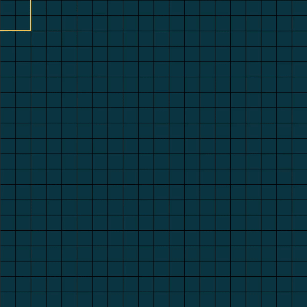
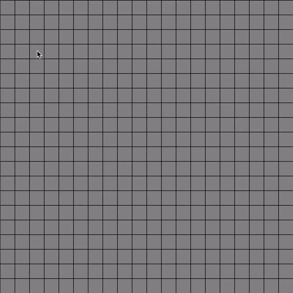
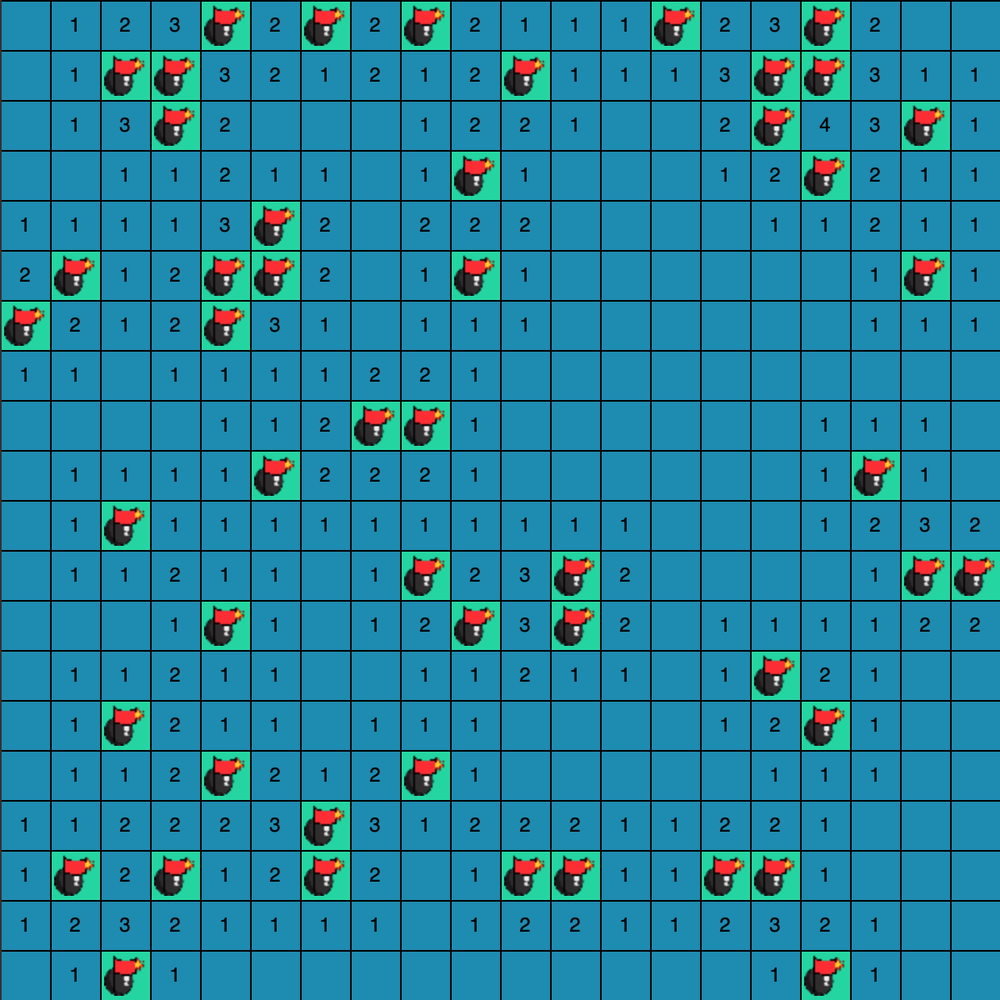
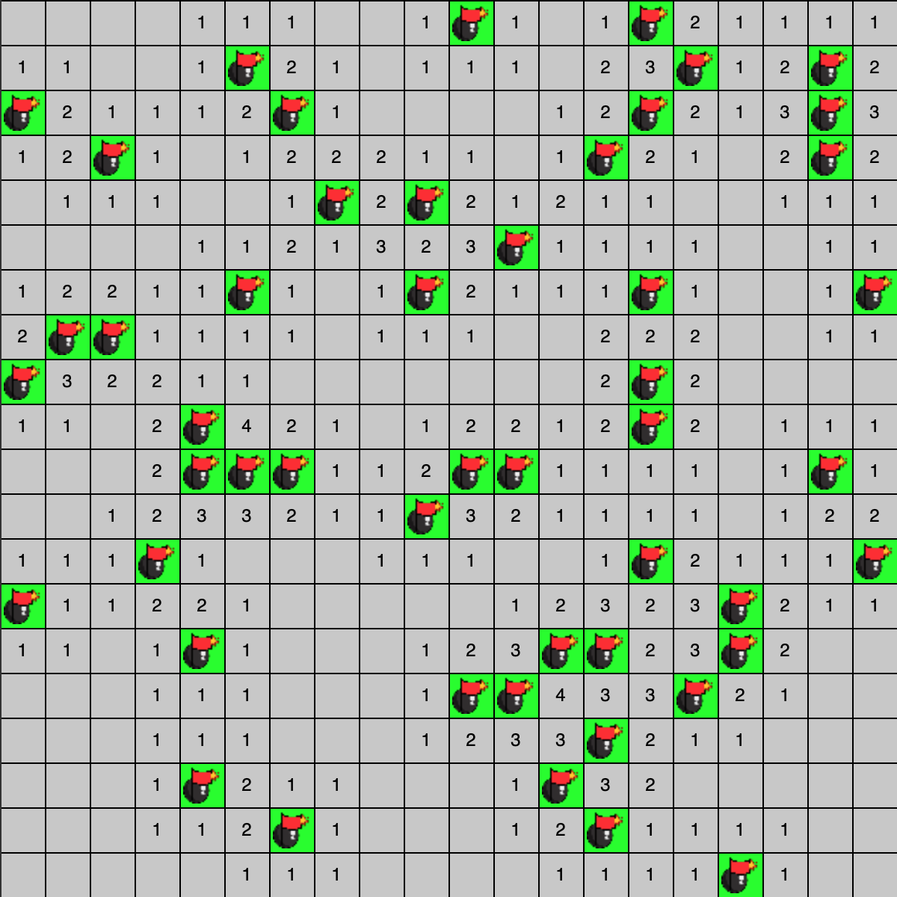
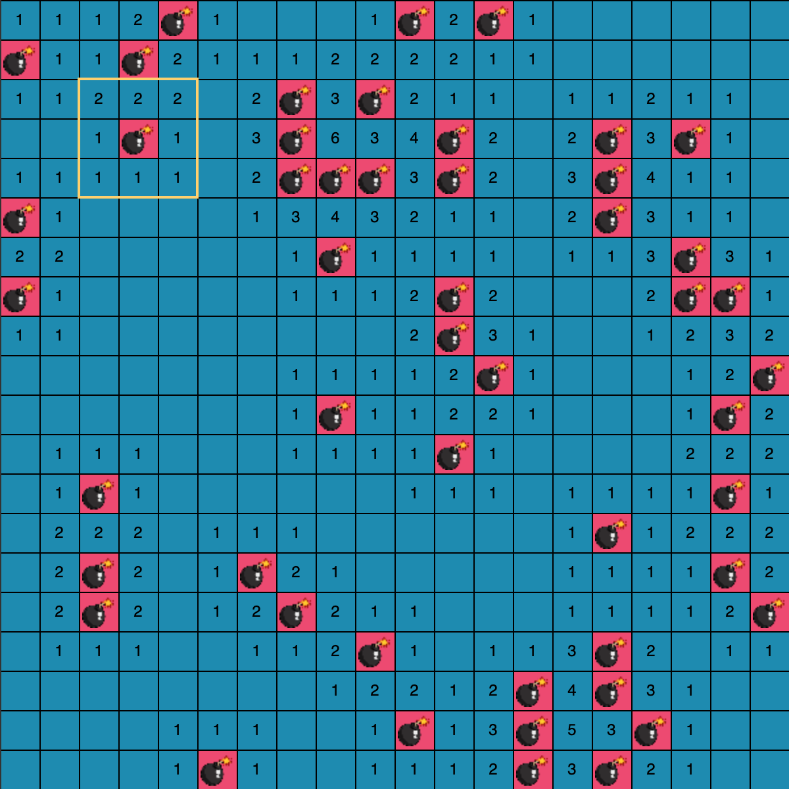
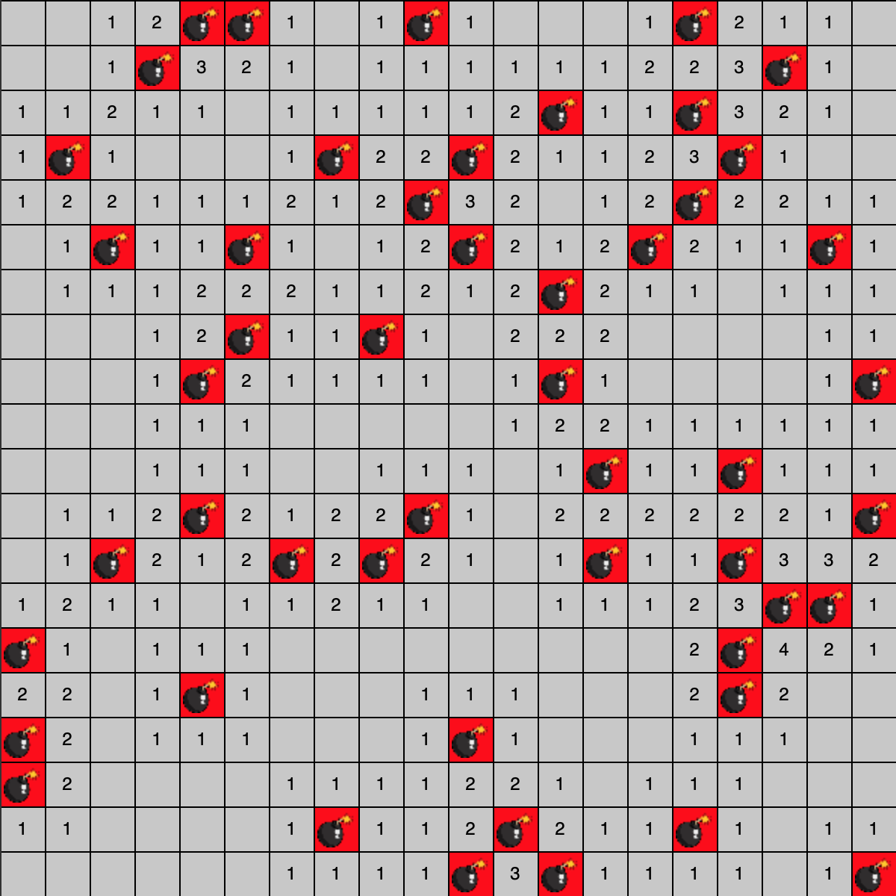
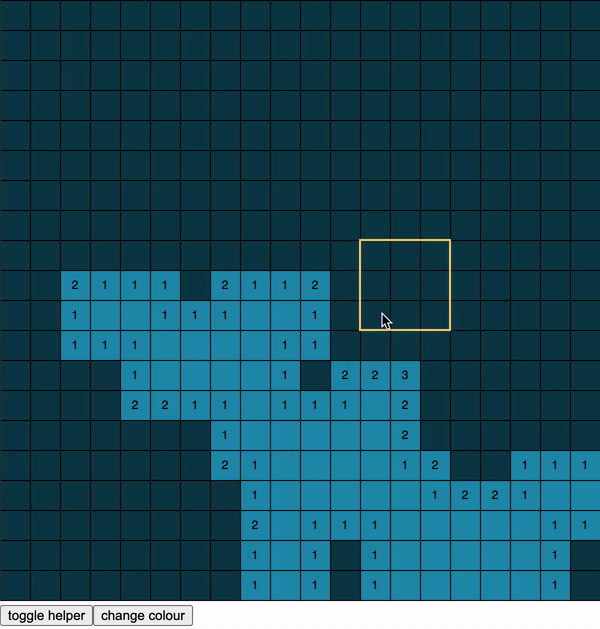

# Mine Sweeper

### A simple mine sweeper game

Made with Javascript and visualized with the p5.js library.

---

Features:
- Colour can be toggled between a light and dark mode
- A helper square can be toggled on and off
- Right-click to place a flag
- 20x20 square which can be changed
- 50 mines which can be changed

Game Rules
- Objective: reveal all squares which are not mines
- Click a square to reveal it
- Right-click a square to place a flag to mark a mine
- The number on each square reveals how many mines in the 8 adjacent squares

---

### Win

---

### Lose

---

### Features (Toggle colour mode & helper)

